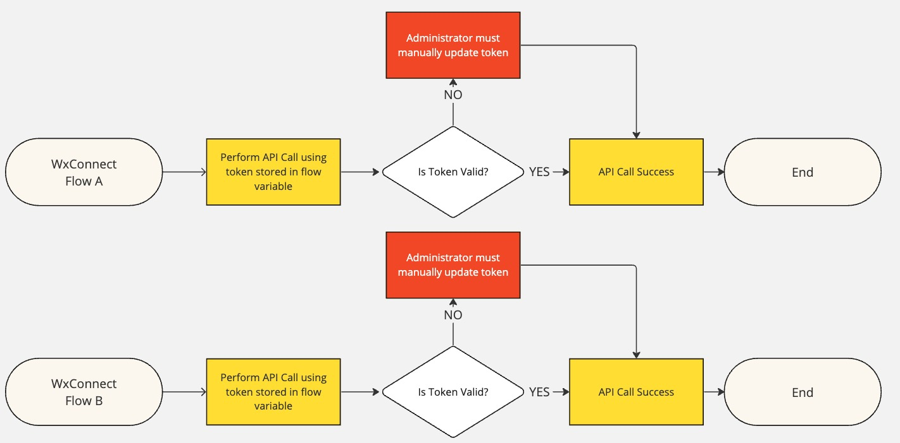
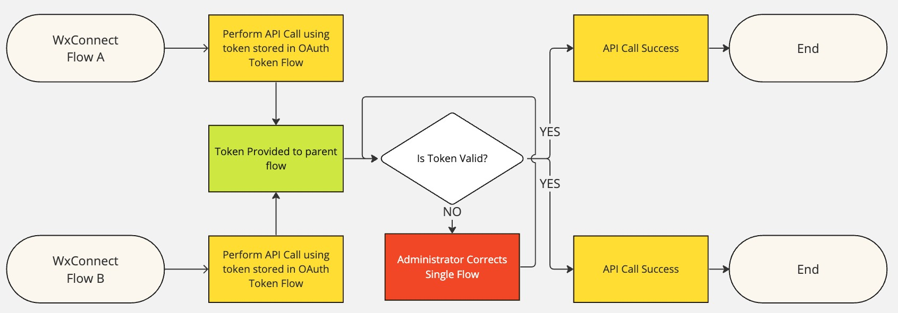
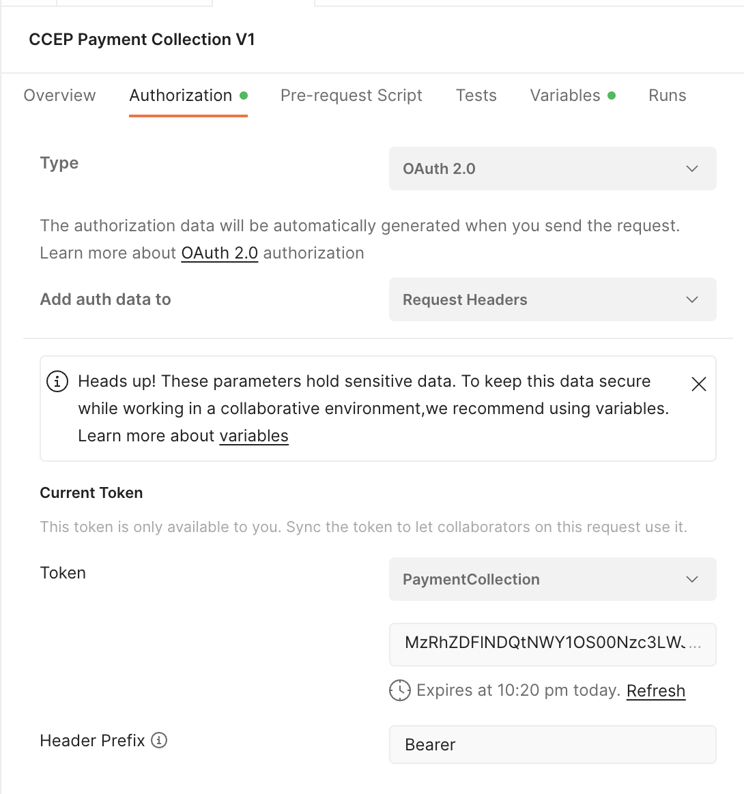
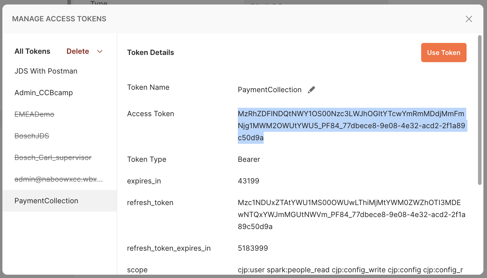

# GetOAuthToken Webex Connect Flow

# License
All contents are licensed under the MIT license. Please see [license](LICENSE) for details.

# Disclaimer
Everything included is for demo and Proof of Concept purposes only. Use of the site is solely at your own risk. This site may contain links to third party content, which we do not warrant, endorse, or assume liability for. These demos are for Cisco Webex usecases, but are not Official Cisco Webex Branded demos.

# Questions
Please contact the CCEP team at [ccep@cisco.com](mailto:ccep@cisco.com?subject=payment-collections-demo) for questions.

### Solution Goals
A Webex Connect flow that will provide an OAuth token to a parent flow in the custom variable "JDSToken".  It will provide the bearer token either from a token management service, or from a static token you provide. This flow converges any token changes into a single point, simplifying administration.

The advantage of this flow is that it allows you to just call it from any other flow without any real details, and use the provided OAuth token in any number of other flows.  If you specify the token in each flow, any changes need to be performed across each flow individually, once for each flow using the token.

This flow converges any token changes or troubleshooting that need to happen into a single flow, allowing one change to the OAuth flow to affect multiple other flows.

We recommend using a token store as this will eliminate the need to manually populate a new OAuth token every 12 hours, but requires set up of its own. Set up a [token store](https://github.com/WebexSamples/webex-contact-center-api-samples/tree/main/token-management-samples/token-service-sample) using the [tutorial video](https://app.vidcast.io/share/ed971770-49bb-47e5-96d0-7c920074fd53) to automatically manage the token renewal process.  Even if you choose not to use a token store, this flow still allows you to specify your OAuth token in only one place and reuse it across multiple other flows without changing them individually.

# Change Log

|Change Title|Date|Details|
|:---|:---:|:---|
|Repo Creation|2/16/24|Took flow from existing [Payment Collection](https://github.com/TeamCCEP/PaymentCollections) repository and created its own much simpler repo.|

### Installing Get OAuth Token Workflow

1. Log into Connect and open the service you want to use.
2. Go to Flows and create a flow. Name it GetOAuthToken and upload the CCEP_GetOAuthToken.workflow file.
3. A configuration page will appear titled “Configure Webhook”. Choose the box for “Create new event”, name it “CCEP_GetOAuthToken” and populate the sample input with the below JSON. Click the Parse button, then click Save.

    {

    "hook": "null"

    }

4. Click the cog in the top right and open the custom variables page.  If you are using the token service mentioned earlier, populate the Token-Service-URL and x-token-passphrase.  If you are not using the token service, populate the StaticToken with a valid OAuth token using the next two steps, and remember to change it every 12 hours. **Do not populate the JDSToken Variable**  Save and publish the workflow, and skip the next two steps if you are using a token store.
5. Go to postman, open the Authorization tab of a collection that is set up with the token you want to use. In the “Current Token” area, notice that the token expiry time is listed. If it is before your demo will happen, make sure to refresh the token at a time that gives you a valid token for the demo. Next, click the drop-down, and then manage tokens.  
      
    
6. Choose your token, copy out the access token, and paste it into the “StaticToken” custom variable field within Webex Connect. Ensure you do not have any whitespace or carriage returns as part of the pasted string. Now save the custom variables in Webex Connect, save the flow, and make live.  
      
    

    ### Using the GetOAuthToken Flow

    1. Create a new custom variable in your main flow named "JDSToken".  Do not populate the default value.

    2. Somewhere before you need to use the OAuth token, slot in a "Call Flow" Node.  Set the workflow name to the flow we just imported.  The node type and name should auto populate to "--All--" and "Configure Webhook--X" or similar.

    3. Save and make flow live.  Your main flow should get the custom variable "JDSToken" Populated from the sub flow.  If you have issues, leverage the HTTP request node at the end of the GetOAuthToken flow to post debugging to webhook.site or similar for troubleshooting.